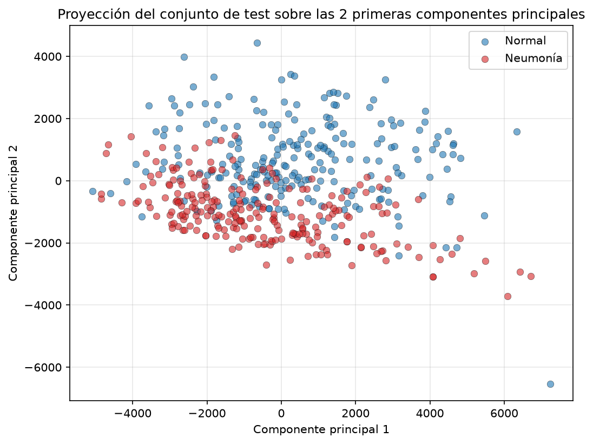
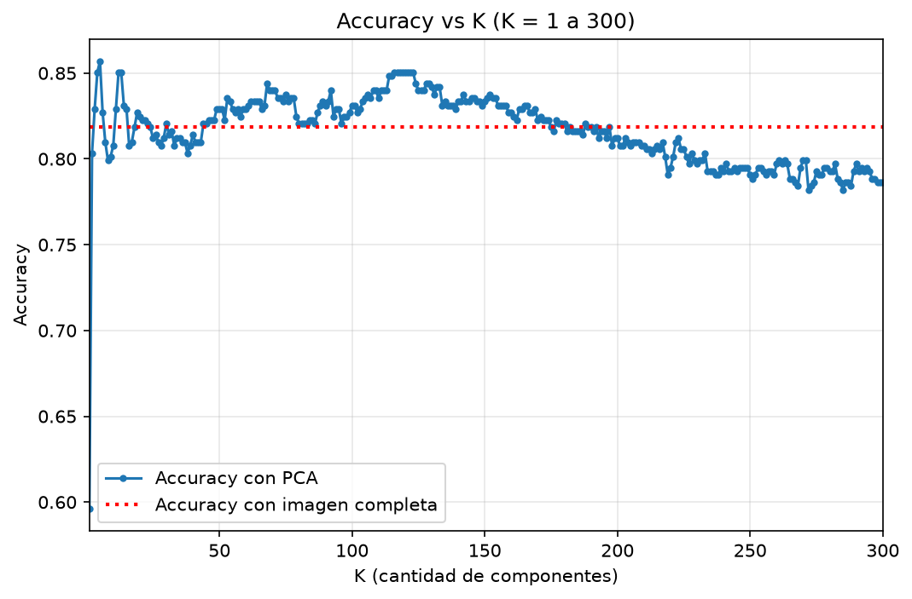
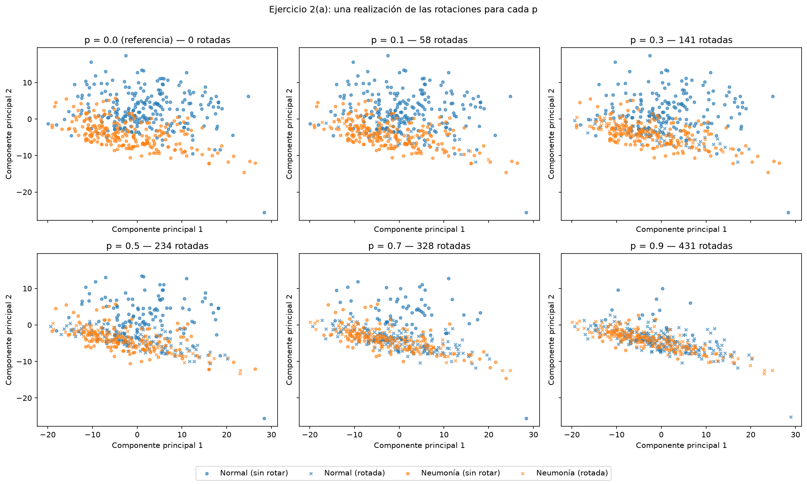
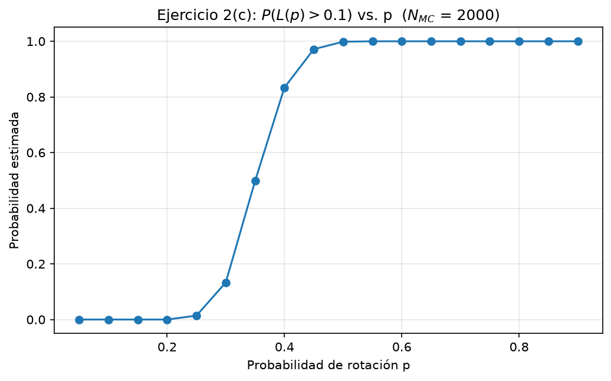
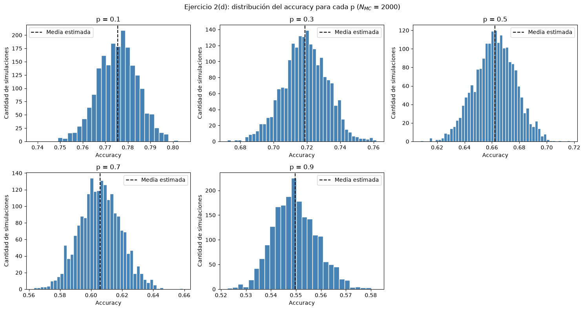
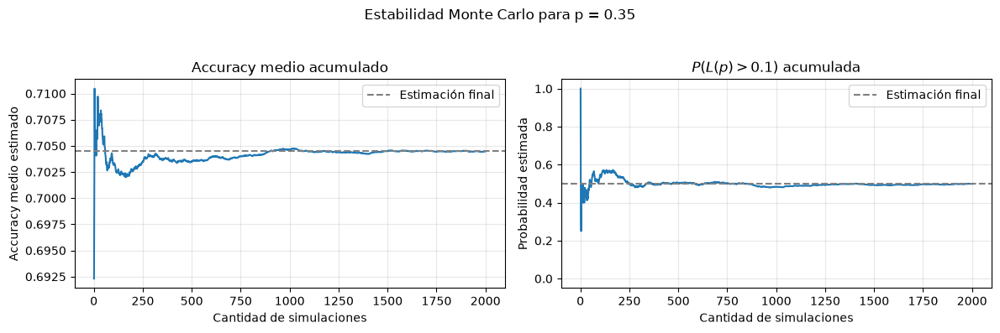

# PCA & Monte Carlo on PneumoniaMNIST

PCA dimensionality reduction and Monte Carlo robustness analysis of a pneumonia X-ray classifier (PneumoniaMNIST).

> Project developed for **I206 – Inferencia y Estimación** (Ingeniería en Inteligencia Artificial, Universidad de San Andrés, 2026).

---

## Overview

Chest X-ray images live in a very high-dimensional space: each 128×128 image is a vector of 16,384 pixel values, many of them highly correlated. This project explores two questions:

1. **How much can the data be compressed?** Using Principal Component Analysis (PCA), each image is projected onto a small number *K* of principal components. A logistic regression classifier (healthy vs. pneumonia) is used as a benchmark to measure how much useful information survives the compression.
2. **How robust is the resulting system?** Some test images may arrive with the wrong orientation. A Monte Carlo simulation randomly rotates test images by 180° with probability *p* and estimates how the classifier's performance degrades.

Finally, the Monte Carlo estimators are justified theoretically through the **Law of Large Numbers**.

## Dataset

The images come from [PneumoniaMNIST](https://medmnist.com/) (MedMNIST+, 128×128 version): grayscale chest X-rays labeled as

| Label | Class |
|---|---|
| `0` | Normal |
| `1` | Pneumonia |

| Split | Images | Class balance |
|---|---|---|
| Train | 2,428 | 1,214 / 1,214 |
| Test | 468 | 234 / 234 |

The dataset is **not included** in this repository. To run the notebook, place it in the project root with this structure:

```
dataset_tp1/
├── train/              # PMINST_0001.png, ...
├── test/               # PMINST_2429.png, ...
├── train_labels.csv
└── test_labels.csv
```

## Methods

### Principal Component Analysis (SVD-based)

- Images are flattened into row vectors to build the data matrix **X** ∈ ℝ^(n×m).
- The mean is estimated and removed using the **training set only**.
- PCA is computed via the Singular Value Decomposition of the centered training matrix, which avoids building the 16,384 × 16,384 covariance matrix.
- Both training and test data are projected onto the first *K* principal directions learned from the training set.

### Classification

A logistic regression model (`scikit-learn`) is trained on the full images (baseline) and on the PCA projections for several values of *K*. Performance is measured with accuracy on the test set.

### Monte Carlo robustness analysis

With the PCA (*K* = 2) + logistic regression pipeline trained once on unperturbed data:

- In each simulation, every test image is independently rotated 180° with probability *p*.
- The accuracy *A_p* and the loss *L(p) = A_0 − A_p* are recorded.
- Over *N_MC* independent simulations, the following are estimated as functions of *p*:
  - the expected accuracy **E[A_p]**,
  - the probability **P(L(p) > δ)** with δ = 0.1,
  - the empirical distribution of *A_p* (histograms).

## Repository structure

```
.
├── notebooks/
│   └── TP1_pca_montecarlo.ipynb   # Exercise 1 (PCA, accuracy vs. K) + Exercise 2 (Monte Carlo)
├── report/                  # LaTeX report
├── figures/                 # Plots used in the report and this README
├── requirements.txt
└── README.md
```

## Getting started

```bash
git clone https://github.com/<your-user>/pca-montecarlo-pneumonia.git
cd pca-montecarlo-pneumonia
pip install -r requirements.txt
jupyter notebook notebooks/TP1_pca_montecarlo.ipynb
```

`requirements.txt`:

```
numpy
pandas
pillow
scikit-learn
matplotlib
jupyter
```

## Results

### Test set in the first two principal components



### Accuracy vs. number of components



### Effect of random rotations on the PCA space



### Expected accuracy vs. rotation probability

![E[A_p]](figures/expected_accuracy_vs_p.png)

### Probability of exceeding the loss tolerance



### Accuracy distributions



### Stability of the Monte Carlo estimates



The curves show how the estimated mean accuracy and loss probability change as more simulations are included.

## Authors

- Bautista Alsina
- Santos Bunge
- Hans Dietrich

## References

- Yang, J. et al. (2024). *MedMNIST+*: PneumoniaMNIST (128×128).
- Leon-Garcia, A. (2008). *Probability, Statistics, and Random Processes for Electrical Engineering* (3rd ed.). Prentice Hall.
- Mahmood, B. (2016). *How to Predict Yes/No Outcomes Using Logistic Regression.* Medium.
